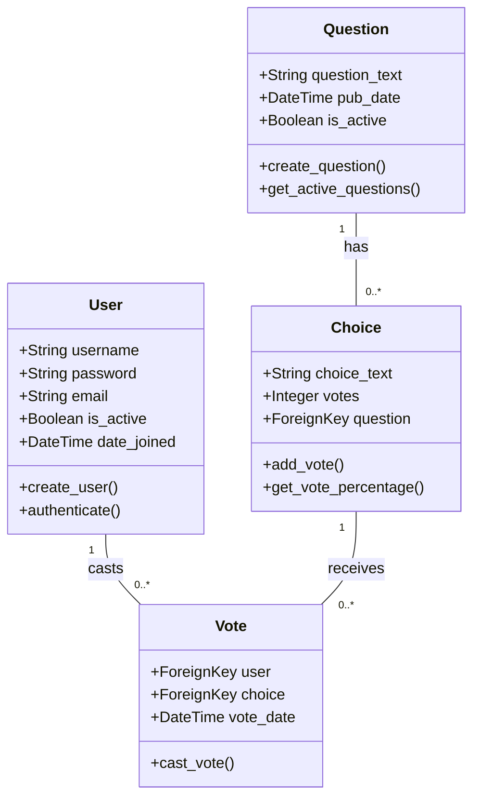

# KU Polls Class Diagram

## Class Descriptions

### User
- Represents system users
- Handles authentication and authorization
- Manages user sessions

### Question
- Represents poll questions
- Manages question lifecycle
- Tracks publication dates

### Choice
- Represents poll options
- Tracks vote counts
- Calculates vote percentages

### Vote
- Records user votes
- Links users to choices
- Tracks voting timestamps

## Relationships
1. User to Vote: One-to-Many
   - A user can cast multiple votes
   - Each vote belongs to one user

2. Question to Choice: One-to-Many
   - A question can have multiple choices
   - Each choice belongs to one question

3. Choice to Vote: One-to-Many
   - A choice can receive multiple votes
   - Each vote is for one choice 