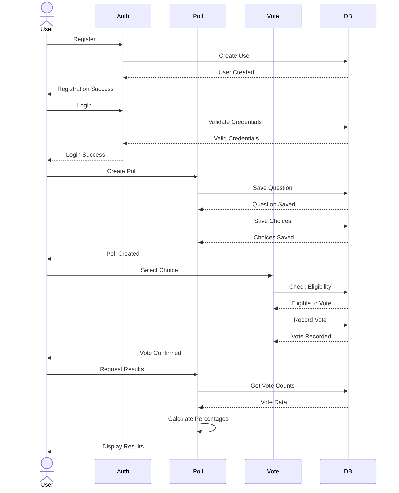

# KU Polls Sequence Diagram

## Sequence Descriptions

### User Registration Flow
1. User submits registration form
2. Authentication system creates user record
3. Database confirms creation
4. User receives success message

### User Login Flow
1. User submits login credentials
2. System validates credentials
3. Database confirms validity
4. User receives login confirmation

### Poll Creation Flow
1. User submits poll details
2. System saves question
3. System saves choices
4. User receives creation confirmation

### Voting Flow
1. User selects choice
2. System checks voting eligibility
3. System records vote
4. User receives vote confirmation

### Results Viewing Flow
1. User requests results
2. System retrieves vote data
3. System calculates percentages
4. User views results display 