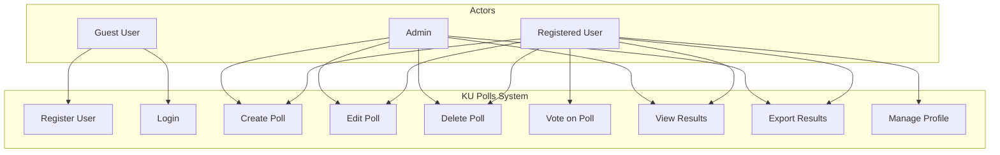

# KU Polls Use Case Diagram

## Use Case Descriptions

### Guest User Use Cases
1. **Register User**
   - Actor: Guest User
   - Description: Create a new user account
   - Preconditions: None
   - Postconditions: New user account created

2. **Login**
   - Actor: Guest User
   - Description: Authenticate and access system
   - Preconditions: Valid user account
   - Postconditions: User session created

### Registered User Use Cases
3. **Create Poll**
   - Actor: Registered User
   - Description: Create a new poll with choices
   - Preconditions: User is logged in
   - Postconditions: New poll created

4. **Edit Poll**
   - Actor: Registered User
   - Description: Modify existing poll details
   - Preconditions: User owns the poll
   - Postconditions: Poll updated

5. **Delete Poll**
   - Actor: Registered User
   - Description: Remove a poll
   - Preconditions: User owns the poll
   - Postconditions: Poll deleted

6. **Vote on Poll**
   - Actor: Registered User
   - Description: Cast vote on active poll
   - Preconditions: User hasn't voted
   - Postconditions: Vote recorded

7. **View Results**
   - Actor: Registered User
   - Description: View poll results
   - Preconditions: Poll exists
   - Postconditions: Results displayed

8. **Export Results**
   - Actor: Registered User
   - Description: Download poll results
   - Preconditions: Poll has votes
   - Postconditions: Results exported

9. **Manage Profile**
   - Actor: Registered User
   - Description: Update user profile
   - Preconditions: User is logged in
   - Postconditions: Profile updated

### Admin Use Cases
- All poll management capabilities
- System-wide access
- User management
- Data export capabilities 